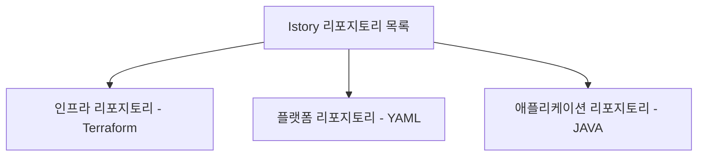

## 1. 리포지토리 구조
리포지토리 구조는 아래와 같습니다.


<br>
<br>

| 리포지토리 명 | 주소 | 구현언어 | 
| ------------- | ---- | --------- |
| 인프라 리포지토리     | https://github.com/istory/terraform | Terraform |
| 플랫폼 리포지토리     | https://github.com/istory/yml | YAML |
| 애플리케이션 리포지토리      | https://github.com/istory/java | JAVA |

## 2. 디렉토리 만들기
목표하는 폴더 구조는 아래와 같습니다.
```bash
istory-platform/
├── base/
│   ├── istory-db-deploy.yaml     # MySQL Pod
│   ├── istory-db-config.yaml     # MySQL ConfigMap
│   ├── istory-db-secret.yaml     # MySQL Secret
│   ├── istory-db-pvc.yaml        # PVC
│   ├── istory-db-sc.yaml         # StorageClass
│   └── ... (앱 관련 리소스)
├── overlay/
│   ├── aws-dev/                  # dev에서는 MySQL 사용
│   └── aws-prod/                 # prod에서는 RDS 사용 (MySQL 리소스 제거 필요)
```

